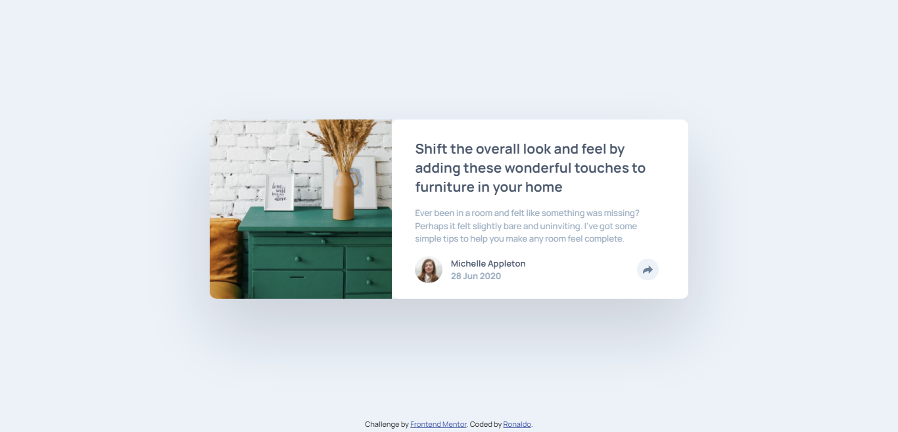

 

# Frontend Mentor - Article preview component solution

This is a solution to the [Article preview component challenge on Frontend Mentor](https://www.frontendmentor.io/challenges/article-preview-component-dYBN_pYFT). Frontend Mentor challenges help you improve your coding skills by building realistic projects.

## Table of contents

- [Overview](#overview)
  - [The challenge](#the-challenge)
  - [Screenshot](#screenshot)
  - [Links](#links)
- [My process](#my-process)
  - [Built with](#built-with)
  - [Useful resources](#useful-resources)
- [Author](#author)

## Overview

### The challenge

Users should be able to:

- View the optimal layout for the component depending on their device's screen size
- See the social media share links when they click the share icon

### Screenshot

### Links

- Solution URL: [github.com/marckesin/Article-preview-component](https://github.com/marckesin/Article-preview-component)
- Live Site URL: [marckesin.github.io/Article-preview-component/](https://marckesin.github.io/Article-preview-component/)

## My process

### Built with

- Semantic HTML5 markup
- CSS/SAAS
- Flexbox
- CSS Grid
- Mobile-first workflow
- Javascript

### Useful resources

- [https://developer.mozilla.org/pt-BR/docs/Web/API/Touch_events](https://developer.mozilla.org/pt-BR/docs/Web/API/Touch_events) - This helped me to understand how to handle touch events.

## Author

- Frontend Mentor - [@marckesin](https://www.frontendmentor.io/profile/marckesin)
- Linkedin - [marckesin](https://www.linkedin.com/in/marckesin)
- Codewars - [marckesin](https://www.codewars.com/users/marckesin)
